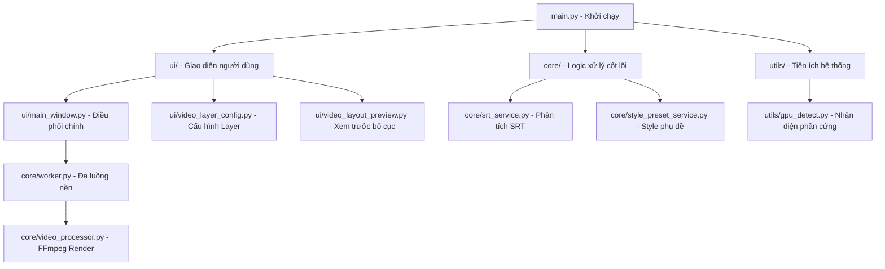
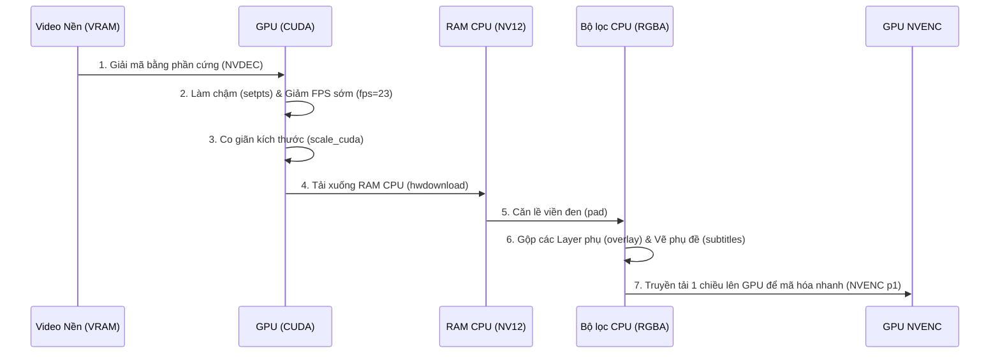

# Hướng dẫn Kiến trúc Hệ thống EncoMie (Architecture & Logic Guide)

Tài liệu này ghi nhận chi tiết cấu trúc thư mục, kiến trúc luồng xử lý (Render Pipeline), cơ chế quản lý tài nguyên và các logic cốt lõi của phần mềm **EncoMie** nhằm phục vụ việc bảo trì, tối ưu hóa và phát triển tính năng mới một cách dễ dàng và hệ thống.

---

## 1. Bản đồ Cấu trúc Dự án (Project Structure Map)

*   **`main.py`**: Điểm khởi chạy chương trình. Chứa hook đặc biệt ghi đè `subprocess.Popen` trên Windows để ẩn hoàn toàn cửa sổ console màu đen khi FFmpeg hoạt động ngầm.
*   **`core/`**:
    *   `video_processor.py`: Chứa toàn bộ logic xây dựng câu lệnh FFmpeg (`build_ffmpeg_cmd`) và hàm điều phối render (`render_pair`).
    *   `worker.py`: Quản lý đa luồng Qt (`QThread`). Chia nhỏ các lượt render thành các `SingleRenderJob` chạy song song mà không khóa (freeze) giao diện ứng dụng.
    *   `srt_service.py`: Phân tích cú pháp tệp SRT và hỗ trợ render phụ đề nâng cao.
*   **`ui/`**:
    *   `main_window.py`: Quản lý trạng thái giao diện, bảng danh sách tệp, các luồng kết nối tín hiệu (signals/slots) và ghi nhận log FFmpeg.
    *   `video_layer_config.py` & `video_layout_preview.py`: Quản lý cấu hình 5 Layer đè (Overlay) và render giao diện xem trước (preview) dạng kéo thả trực quan.
*   **`utils/`**:
    *   `gpu_detect.py`: Nhận diện thông số CPU, RAM, dòng card đồ họa GPU NVIDIA và kiểm tra tính tương thích của bộ mã hóa NVENC phần cứng.

---

## 2. Kiến trúc Render Pipeline (Hybrid GPU-CPU)

Quy trình xử lý video của EncoMie được thiết kế theo dạng **Hybrid (Lai ghép)** để tận dụng tối đa phần cứng đồ họa (GPU NVIDIA) nhưng vẫn giữ được độ tương thích 100% với các bộ lọc phức tạp trên CPU.

### Chi tiết các bước xử lý trong `build_ffmpeg_cmd`:

1.  **Giải mã phần cứng GPU (GPU Decoding):**
    *   Nếu bật GPU, video nền được giải mã trực tiếp trong VRAM bằng NVDEC thông qua cờ:
        `"-hwaccel", "cuda", "-hwaccel_output_format", "cuda"`
2.  **Giảm FPS sớm (Early FPS Drop):**
    *   Thực hiện giảm tốc độ khung hình (ví dụ về 23.976 FPS) ngay trong VRAM bằng cách thêm filter `fps` ngay sau `setpts`. Nhờ đó, loại bỏ được ~65% khung hình thừa trước khi thực hiện các tác vụ nặng tiếp theo.
3.  **Co giãn kích thước phần cứng (GPU Scaling):**
    *   Sử dụng bộ lọc `scale_cuda` (thuật toán `bilinear`) để thay đổi kích thước video gốc về độ phân giải đích (ví dụ 1280x720) ngay trong VRAM GPU.
4.  **Tải ngược bộ nhớ (PCIe Download):**
    *   Khung hình đã thu nhỏ (chỉ nặng khoảng 1.38 MB/frame) được tải về CPU bằng bộ lọc `hwdownload,format=nv12`. Lưu lượng qua PCIe lúc này cực kỳ nhỏ, tránh nghẽn băng thông hệ thống.
5.  **Xử lý ghép Layer & Phụ đề trên CPU:**
    *   Tác vụ `pad` (thêm viền đen), gộp các Layer đè (logo, video phụ dạng RGBA hỗ trợ độ mờ alpha channel) và bộ lọc vẽ chữ phụ đề `subtitles` (libass) được thực hiện trên CPU để đảm bảo tương thích 100% và không bị lỗi crash bộ nhớ GPU.
6.  **Mã hóa bằng GPU (GPU Encoding):**
    *   Gửi khung hình hoàn thiện lên nhân mã hóa phần cứng **NVENC** của card đồ họa với preset hiệu năng cao **`p1` (Fastest)** để xuất tệp MP4 siêu tốc.

---

## 3. Cơ chế Quản lý Tài nguyên & Đa luồng (Resource Management)

### A. Phân bổ luồng CPU thông minh (Smart CPU Threading)
Để tránh hiện tượng CPU chạy 100% công suất làm đơ cứng toàn bộ máy tính khi render, hệ thống tự động tính toán giới hạn số luồng gán cho mỗi tiến trình FFmpeg:
*   Mã nguồn tự động chừa lại ít nhất **2 luồng CPU** cho các tác vụ của hệ điều hành.
*   Công thức phân bổ luồng cho từng lượt render chạy song song:
    $$\text{allocated\_threads} = \max\left(1, \frac{\text{Tổng luồng CPU} - 2}{\text{Số tiến trình render song song}}\right)$$
*   Luồng này được áp dụng trực tiếp vào bộ giải mã/mã hóa (`-threads`) và xử lý bộ lọc (`-filter_threads`).

### B. Độ ưu tiên tiến trình (Process Priority)
Mọi tiến trình FFmpeg khởi chạy từ Qt Worker đều được thiết lập cờ hệ thống thấp:
*   `BELOW_NORMAL_PRIORITY_CLASS` (0x00004000)
*   Cờ này hướng dẫn bộ điều phối của Windows luôn ưu tiên cấp CPU cho các hoạt động tương tác của người dùng trước, ngăn ngừa tối đa việc đứng máy.

---

## 4. Hướng dẫn Bảo trì & Mở rộng (Maintainer Guide)

### Cách tinh chỉnh tốc độ và chất lượng:
*   **Muốn tăng chất lượng hình ảnh sắc nét hơn nữa:** Trong `video_processor.py`, hãy đổi thuật toán co giãn từ `bilinear` sang `bicubic` hoặc `lanczos` (trong bộ lọc `scale_cuda` và `scale`).
*   **Muốn giảm dung lượng tệp xuất ra:** Tăng giá trị `-qp` lên (ví dụ `-qp 26`) hoặc đổi sang chế độ quản lý bitrate trung bình (VBR/CBR).

### Lưu ý quan trọng khi sửa đổi bộ lọc FFmpeg:
*   Mọi bộ lọc chạy trước `hwdownload` phải là các bộ lọc thuộc nhóm tăng tốc CUDA (đầu vào và đầu ra dạng `cuda`).
*   Mọi bộ lọc chạy sau `hwdownload` bắt buộc phải là bộ lọc CPU tiêu chuẩn (đầu vào dạng `nv12` hoặc các định dạng màu RAM thông thường).
