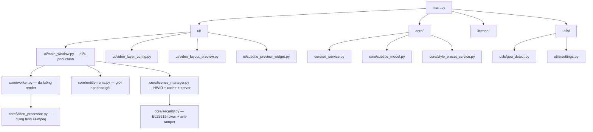
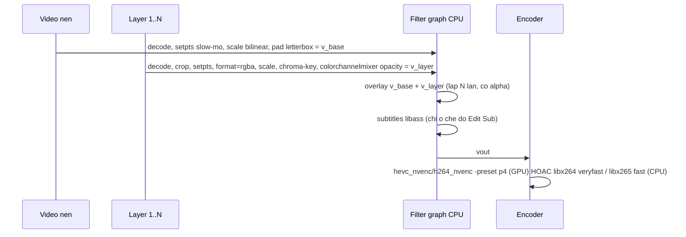

# Hướng dẫn Kiến trúc Hệ thống EncoMie (Architecture & Logic Guide)

Tài liệu này ghi nhận cấu trúc thư mục, luồng render, cơ chế quản lý tài nguyên,
hệ thống bản quyền và các logic cốt lõi của **EncoMie**, phục vụ bảo trì và phát
triển tính năng.

> **Lưu ý về độ chính xác:** phần Render Pipeline trước đây mô tả một pipeline
> "Hybrid GPU-CPU" (`scale_cuda`, `hwdownload`, NVDEC, early-fps-drop). **Pipeline
> đó chưa từng tồn tại trong mã nguồn.** Tài liệu này đã được viết lại theo đúng
> code hiện tại (tháng 9/2026).

---

## 1. Bản đồ Cấu trúc Dự án (Project Structure Map)


```mermaid
graph TD
    Main[main.py] --> UI[ui/]
    Main --> Core[core/]
    Main --> License[license/]
    Main --> Utils[utils/]

    UI --> MW[ui/main_window.py — điều phối chính]
    MW --> Worker[core/worker.py — đa luồng render]
    Worker --> VP[core/video_processor.py — dựng lệnh FFmpeg]
    MW --> Ent[core/entitlements.py — giới hạn theo gói]
    MW --> LM[core/license_manager.py — HWID + cache + server]
    LM --> Sec[core/security.py — Ed25519 token + anti-tamper]

    UI --> LayerCfg[ui/video_layer_config.py]
    UI --> LayoutPrev[ui/video_layout_preview.py]
    UI --> SubPrev[ui/subtitle_preview_widget.py]

    Core --> Srt[core/srt_service.py]
    Core --> SubModel[core/subtitle_model.py]
    Core --> StylePreset[core/style_preset_service.py]

    Utils --> Gpu[utils/gpu_detect.py]
    Utils --> Settings[utils/settings.py]
```

| Thành phần | Vai trò |
|---|---|
| `main.py` | Điểm khởi chạy. Hook ghi đè `subprocess.Popen` trên Windows (`CREATE_NO_WINDOW` + `STARTUPINFO`) để ẩn console đen của FFmpeg. |
| `core/video_processor.py` | Toàn bộ logic dựng lệnh FFmpeg (`build_ffmpeg_cmd`), điều phối render 1 cặp (`render_pair`), chọn nền + slow-motion (`select_bg_segment`), ghép cặp file (`build_pairs`), 2 bộ chuyển SRT→ASS. |
| `core/worker.py` | `RenderWorker` (QThread) chạy event loop nền, spawn tối đa `max_concurrent_renders` `SingleRenderJob` song song, tổng hợp tiến độ, cổng kiểm tra bản quyền. `PairingWorker` quét thư mục nền. |
| `core/license_manager.py` | Sinh HWID (SHA-256 của MachineGuid + hostname + CPU + MAC), cache `%APPDATA%\EncoMie\license.json`, gọi API `activate`/`verify`/`deactivate` (ký HMAC), xác thực offline bằng `exp` của token. |
| `core/security.py` | Ký request (HMAC-SHA256, nonce, timestamp), **verify license token bằng Ed25519 public key nhúng sẵn**, anti-debugger / quét tiến trình khả nghi, HMAC toàn vẹn cache. |
| `core/entitlements.py` | Đọc `features` từ token đã ký, kẹp (clamp) `RenderConfig` xuống đúng gói: tắt NVENC / giới hạn số layer / bật watermark nếu không có token hợp lệ. |
| `core/srt_service.py`, `core/subtitle_model.py` | Parse/ghi/dời/tách/gộp SRT. |
| `ui/main_window.py` | Trạng thái UI, bảng file, signal/slot, log FFmpeg, **các probe nền** (sysinfo, anti-tamper, heartbeat), gọi entitlements trước khi render. |
| `ui/video_layer_config.py`, `ui/video_layout_preview.py` | Cấu hình 5 layer đè + canvas kéo–thả–resize 8 hướng (tab Edit Video, hệ ảo 400×225). |
| `ui/subtitle_preview_widget.py` | Preview phụ đề + logo (tab Edit Sub, hệ 1280×720). |
| `license/` | Dialog kích hoạt + dialog thông tin bản quyền. |
| `utils/gpu_detect.py` | `detect_gpu()` (nvidia-smi + `ffmpeg -encoders`), `detect_system_info()` (CPU%/RAM qua Win32, tên CPU qua registry). |
| `utils/settings.py` | Lưu/khôi phục `settings.json`. |

Server bản quyền là dự án **riêng biệt** tại `D:\Cursor\Server` (Cloudflare
Worker + D1 + KV). Xem `D:\Cursor\Server\docs\SECURITY_PHASE1.md`.

---

## 2. Kiến trúc Render Pipeline (thực tế)

**Toàn bộ bộ lọc chạy trên CPU. GPU chỉ tham gia ở bước mã hóa cuối (NVENC).**
Không có `-hwaccel`, không `scale_cuda`, không `hwdownload`. Đây là đánh đổi có
chủ ý: đường CPU tương thích 100% với alpha per-pixel (chroma key), độ mờ layer,
và `libass` — những thứ `overlay_cuda` của FFmpeg hiện **không** làm được (xem §7).


```mermaid
sequenceDiagram
    participant Bg as Video nen
    participant L as Layer 1..N
    participant CPU as Filter graph CPU
    participant Enc as Encoder

    Bg->>CPU: decode, setpts slow-mo, scale bilinear, pad letterbox = v_base
    L->>CPU: decode, crop, setpts, format=rgba, scale, chroma-key, colorchannelmixer opacity = v_layer
    CPU->>CPU: overlay v_base + v_layer (lap N lan, co alpha)
    CPU->>CPU: subtitles libass (chi o che do Edit Sub)
    CPU->>Enc: vout
    Enc->>Enc: hevc_nvenc/h264_nvenc -preset p4 (GPU) HOAC libx264 veryfast / libx265 fast (CPU)
```

### `build_ffmpeg_cmd` — các bước

1. **Chọn active layers**: duyệt 5 `ImageLayerConfig`, bỏ layer tắt / không có
   path / không có video stream (`has_video_stream` = 1 lần `ffprobe`/layer).
2. **Budget luồng**: xem §3.
3. **Chọn vcodec**: `config.use_gpu` → `config.codec` (nvenc); ngược lại
   `libx265` nếu tên codec chứa `hevc`, còn lại `libx264`.
4. **Inputs**: mỗi input kèm `-thread_queue_size 1024`. Nền có `-ss`/`-t` (cắt
   đoạn ngẫu nhiên). Layer video có `-stream_loop -1`. **Không** đặt `-threads`
   trước `-i`.
5. **Nền**: `[0:v] setpts={PTS/speed_factor} , scale=W:H:flags=bilinear:force_original_aspect_ratio=decrease , pad=W:H:(ow-iw)/2:(oh-ih)/2 [v_base]`.
   `speed_factor = slow_pct/100` (slow-motion 35–45%). Frame rate đặt ở **output**
   (`-r {fps}`), không có filter `fps` sớm.
6. **Mỗi layer**: `[N:v] {crop=} {setpts=} format=rgba , scale={pixel_w}:-2:flags=bilinear , {colorkey/despill=} colorchannelmixer=aa={opacity} , setsar=1 [v_layer_N]`
   rồi `[base][v_layer_N] overlay={x=…:y=…} [next]`.
   - `size ≤ 150` → phần trăm khung; `size > 150` → pixel tuyệt đối (hệ ảo).
   - Vị trí đè: 0=BR 1=BL 2=TR 3=TL 4=Center; lề `margin_*` quy đổi theo tỉ lệ.
7. **Phụ đề** (chỉ Edit Sub): `[final] subtitles='<temp>.auto.ass' [vout]`. Xem §4.
   Chế độ Edit Video: `[final] null [vout]`.
8. **Encode**: `-filter_threads {filter_threads} -filter_complex … -map [vout] -map 1:a -c:v {vcodec} [-r {fps}] {preset} {quality} -pix_fmt yuv420p -c:a aac -b:a 192k -threads 0 -shortest -movflags +faststart {out}`.
   - GPU: `-preset p4 -qp 23`.
   - CPU: `-preset veryfast` (x264) / `-preset fast` (x265), `-crf 23`.

### `render_pair` → `_run_ffmpeg`

- Chọn đoạn nền (`select_bg_segment`): xáo trộn danh sách nền, chọn ngẫu nhiên
  `slow_pct` trong [slow_min, slow_max], tìm video đủ dài, chọn điểm bắt đầu ngẫu
  nhiên.
- Chuẩn bị `.temp_srt/temp_{i}.*` (xem §4), gọi `build_ffmpeg_cmd`, chạy
  `_run_ffmpeg`.
- `_run_ffmpeg`: `Popen` với `BELOW_NORMAL_PRIORITY_CLASS | CREATE_NO_WINDOW`,
  đọc stdout theo dòng, regex `time=HH:MM:SS.xx` để tính `%` tiến độ (10→98),
  kiểm tra cờ `should_abort` mỗi dòng.

---

## 3. Quản lý Tài nguyên & Đa luồng

### A. Budget luồng CPU
Chừa 2 luồng cho OS/app foreground, chia phần còn lại cho các job song song:

```
filter_threads = max(2, min(16, (os.cpu_count() - 2) // max_concurrent_renders))
```

- Chỉ áp vào `-filter_threads` (bộ lọc scale/overlay/subtitles).
- Encoder dùng `-threads 0` (x264/x265 tự chia frame-thread nội bộ, tốt hơn ép số).
- **Không** đặt `-threads` cho từng input decoder (decode hiếm khi là bottleneck;
  đặt khắp nơi gây over-subscribe khi nhiều input/job chồng lên nhau).

### B. Độ ưu tiên tiến trình
FFmpeg chạy với `BELOW_NORMAL_PRIORITY_CLASS` (0x00004000). Kết hợp với budget
luồng "chừa 2 nhân" ở trên để máy vẫn mượt khi render nền — priority thấp một
mình không đủ nếu số luồng vẫn lấp đầy scheduler.

### C. Giữ UI không bị đơ (Background probes)
Mọi tác vụ shell-out **không** chạy trên UI thread:

| Việc | Cơ chế | Chu kỳ |
|---|---|---|
| Nạp frame preview | `FrameExtractTask` (QRunnable) → `frame_pool` (2 luồng) + cache LRU 50 | theo sự kiện |
| Sysinfo badge + anti-tamper scan (`scan_suspicious_processes`, `is_debugger_present`) | `_BgProbeTask` → `_bg_pool` | 5 s |
| Heartbeat bản quyền (request mạng) | `_LicenseCheckTask` → `_bg_pool` | 2 phút |
| `detect_system_info()` lúc khởi động, `_check_deps()` | `QTimer.singleShot(0, …)` sau `show()` | 1 lần |

`detect_system_info()` dùng `GlobalMemoryStatusEx` / `GetSystemTimes` (ctypes) +
registry cho tên CPU — **không dùng `wmic`** (chậm ~1.1 s và đang bị Windows gỡ).
Chỉ phần GPU còn shell-out `nvidia-smi` (~30 ms), và nằm trong luồng nền.

### D. Cổng bản quyền trong batch
`RenderWorker._start_next_jobs` kiểm tra bản quyền **1 lần khi bắt đầu batch, sau
đó tối đa 1 lần/phút** (dùng chung 1 `LicenseManager`) — không phải mỗi video.
Đường verify này gọi `_run_security_audit(deep=False)` (bỏ `tasklist`, đã có
`_BgProbeTask` quét liên tục).

---

## 4. Render Phụ đề (Edit Sub)

Cả preview lẫn render đều dựng phụ đề ở **hệ quy chiếu cố định 1280×720**, nhờ đó
kích thước/vị trí trên màn hình khớp với video xuất ra. libass sau đó scale từ
1280×720 sang độ phân giải thật.

| Điều kiện | Hàm | Đặc điểm |
|---|---|---|
| `bg_enabled` (có nền hộp) | `convert_srt_to_ass` | Vẽ nhiều lớp: hộp (bo góc bằng path vector), bóng đổ **có hướng** (offset theo `shadow_angle`/`distance`), viền, chữ — mỗi dòng đặt bằng `\pos`. Wrap dòng bằng `QFontMetrics` (khớp preview tuyệt đối). `PlayResX/Y: 1280/720`. |
| còn lại (không nền) | `convert_srt_to_ass_simple` | 1 dòng `Style` v4.00+ suy ra từ style. `BorderStyle=1`, `BackColour` = màu bóng chữ, `Shadow` = 1/2/3. Alignment dùng **numpad trực tiếp** (không remap). Wrap do libass (có thể lệch 1 từ ở câu rất dài). |

> **Vì sao không đưa thẳng `.srt` cho filter `subtitles`:** FFmpeg tự tạo ASS với
> `PlayResY ≈ 288`, khiến `FontSize`/`Outline`/`MarginV` bị hiểu trong không gian
> nhỏ và render **to gấp ~2.5×** so với preview. `original_size` không sửa được.
>
> **Vì sao đường không-bo-góc luôn `Shadow=0`:** với `BorderStyle=3`, libass vẽ
> bóng hộp bằng **màu hộp** lệch xuống-phải → ra một "cái đuôi" đặc mà preview
> không có. Bóng hộp đầy đủ (có hướng, đúng màu) chỉ có ở `convert_srt_to_ass`
> (dùng `bg_corner_radius ≥ 1`).

File tạm: `<project>/.temp_srt/temp_{i}.auto.ass` (không đụng SRT gốc của user).

---

## 5. Bản quyền & Entitlements

### Client
```
LicenseManager.get_machine_id()  → HWID = sha256(MachineGuid|node|arch|cpu|mac)[:32]
activate(key) / check_license()  → ký HMAC(key|machine_id|nonce|ts) + gửi hw_components
   ↳ server trả về license token ký Ed25519
   ↳ core.security.verify_license_token(token)  (dùng _LICENSE_PUBLIC_KEY_B64 nhúng sẵn)
   ↳ tin claim `exp` (UTC tuyệt đối, ~48 h) làm đồng hồ offline duy nhất
cache: %APPDATA%\EncoMie\license.json  (token + HMAC checksum)
```

- **Không còn** cơ chế "grace period = now − saved_at" hay heuristic xoay đồng hồ.
- `core.entitlements.apply_to_render_config(config, info)` chạy **trước mỗi render**
  ở `_start_render`: token không hợp lệ ⇒ coi như `free` ⇒ tắt NVENC (→ `libx264`),
  kẹp số layer về `max_layers`, đặt `watermark_enabled=True`. Patch `is_valid=True`
  không đủ để mở khóa Pro vì `features` rỗng.

### Server (`D:\Cursor\Server` — riêng)
Cloudflare Worker + D1 + KV. Request bắt buộc ký (HMAC + nonce một lần + timestamp
±120 s), response là token Ed25519, `license_devices` enforce `max_devices` + fuzzy
HWID match, rate-limit per-key trên KV, cron quét bất thường. Secrets qua
`wrangler secret` (không nằm trong repo).

### Anti-tamper (`core/security.py`, `_BgProbeTask`)
`is_debugger_present` (Win32), quét tiến trình đen (x64dbg, Cheat Engine, Fiddler,
Wireshark, dnSpy…). Phát hiện ⇒ `QMessageBox` + `sys.exit(0)`. `detect_vm` chỉ là
tín hiệu mềm, không chặn.

---

## 6. Đóng gói (Packaging)

| Script | Công cụ | Ghi chú |
|---|---|---|
| `build.py` | PyInstaller (onedir/`--onefile`) | Nhanh (~1 phút). Bytecode `.pyc` **giải ngược được** → lộ logic bản quyền. Đã thêm cài `requirements.txt` + `--hidden-import=_cffi_backend --collect-submodules=nacl --hidden-import=core.entitlements`. |
| `build_nuitka.py` | Nuitka `--standalone` (compiler `zig` tự tải) | **Khuyến nghị cho bản phát hành.** Biên dịch sang C → không còn bytecode. Build ở `%TEMP%` (tránh IDE/AV khoá file `.c`), tự retry, tự kill tiến trình treo. ~10–20 phút lần đầu. Nhớ scan AV trước khi phát hành. |

Dependency runtime: `PyQt6`, `requests`, `PyNaCl` (+ `cffi`/`_sodium`).

---

## 7. Bảo trì & Mở rộng

### Tinh chỉnh tốc độ / chất lượng
- **Sắc nét hơn**: đổi `flags=bilinear` → `bicubic`/`lanczos` trong `scale` (nền)
  và `scale` (layer) ở `build_ffmpeg_cmd`.
- **Giảm dung lượng**: tăng `-qp`/`-crf` (vd 26), hoặc chuyển sang VBR
  (`-rc vbr -cq 23 -b:v 0` cho NVENC).
- **NVENC preset**: `p4` là cân bằng; `p1` nhanh hơn không đáng kể trên card đời
  mới nhưng chất lượng kém hơn rõ; `p5–p7` chậm dần.

### Debug render
- Đặt biến môi trường `ENCOMIE_DEBUG=1` để bật ~50 dòng chẩn đoán của
  `build_ffmpeg_cmd`/`render_pair` (logger `encomie.video`, mặc định tắt).

### Vì sao KHÔNG có đường GPU đầy đủ (`scale_cuda`/`overlay_cuda`)

Đã đánh giá thực tế trên RTX 5060 + FFmpeg 8.1 (tháng 9/2026):

| Tình huống | CPU (hiện tại) | Full-CUDA | Kết luận |
|---|---:|---:|---|
| Scale thuần, 0 layer | ~34× realtime | ~37× | không cải thiện (NVENC-bound) |
| Layer **đục 100%**, không chroma | 4–9× | 14–22× | 2–3.4× nhanh hơn |
| Layer **opacity < 100%** hoặc **chroma key** | — | — | **`overlay_cuda` không làm được alpha/opacity** — đo pixel: đè đặc, bỏ qua alpha; feed format có alpha ⇒ "Impossible to convert". `chromakey_cuda` cũng fail trong chain. |

Vì workflow thực tế (reaction + chèn khung + xóa nền xanh + độ mờ) **luôn** có
layer cần alpha, phần compositing — bottleneck thật — **không thể** chuyển lên GPU.
Phần chuyển được (`scale`/`pad` nền) lại không phải bottleneck. ⇒ không triển khai.

Nếu FFmpeg tương lai làm `overlay_cuda` hỗ trợ alpha per-pixel: cân nhắc lại,
nhưng phải giữ đường CPU làm fallback cho layer chroma (`chromakey_cuda` không có
`despill`) và codec nền không hỗ trợ cuvid.
